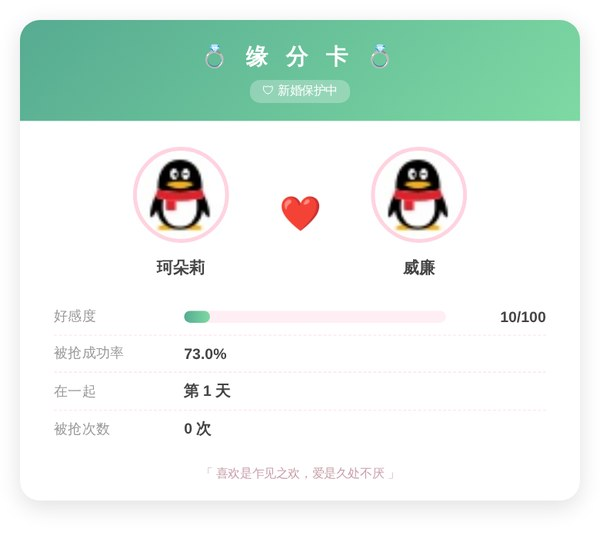
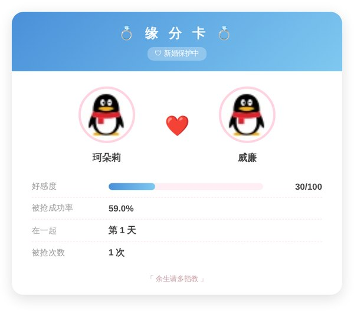
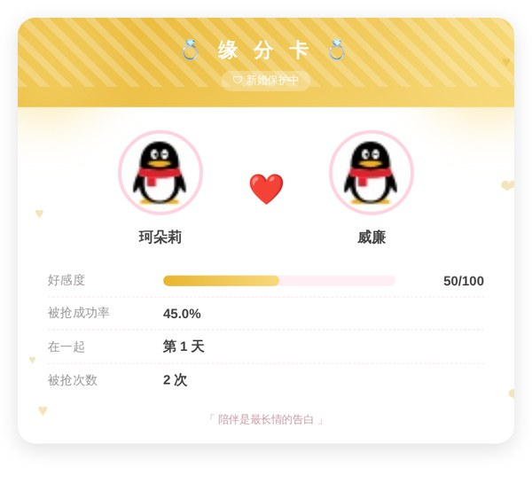
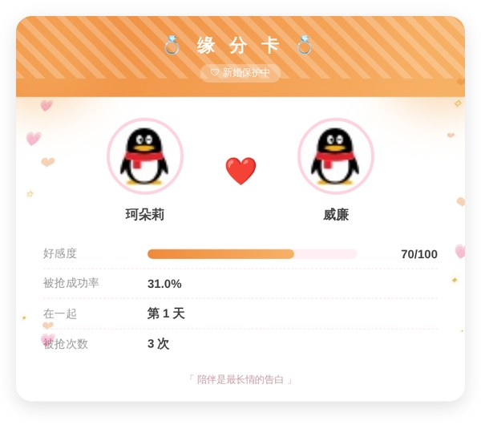
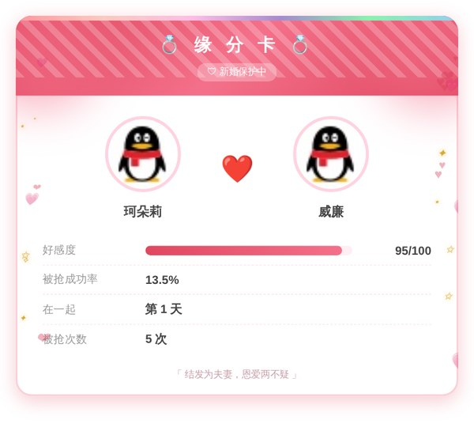
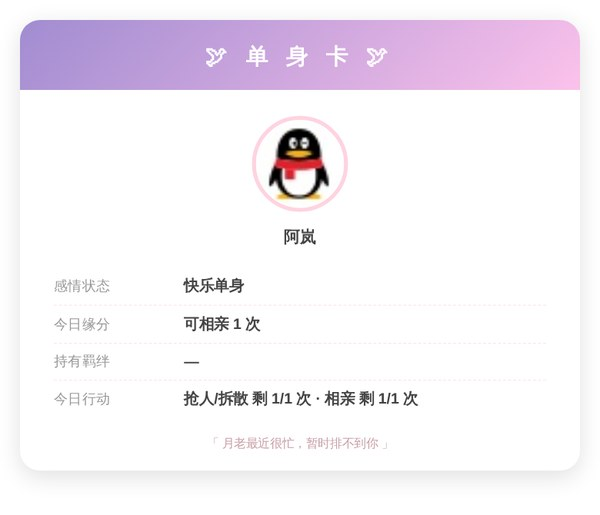
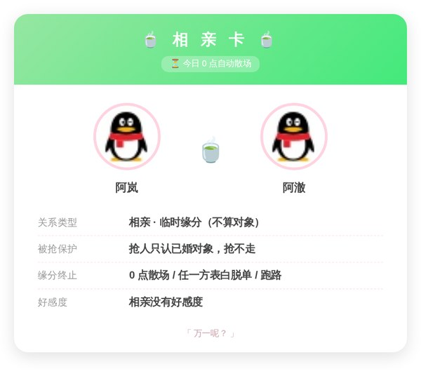
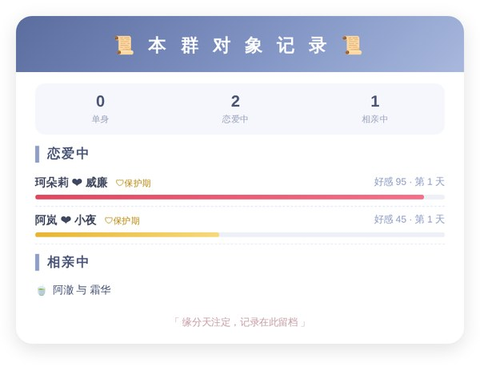
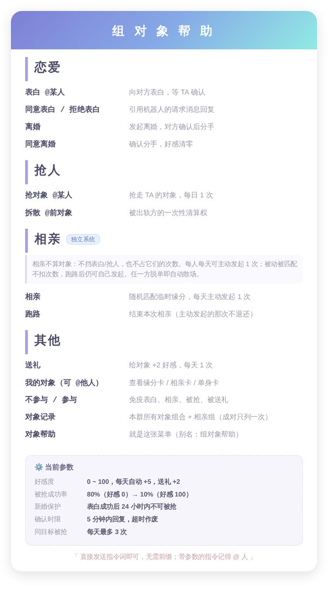

<div align="center">


# 组对象

_✨ [AstrBot](https://github.com/AstrBotDevs/AstrBot) 群恋爱互动插件 ✨_


表白（含出轨线）· 抢对象 · 抢回 · 拆散 · 相亲 · 送礼 · 缘分卡

</div>

---

## ✨ 功能亮点

- **好感度系统**：0~100，每日自动增长，送礼加速；好感越高越难被抢。
- **出轨线**：向已婚者表白成功 → 原关系破裂，原配获得一次性「拆散」权。
- **抢回与羁绊**：被抢走时原配留存羁绊，抢回成功可直接恢复一半好感。
- **独立相亲系统**：不算对象、不挡表白/抢人，每人每天可主动发起 1 次。
- **卡片渲染**：5 档主题随好感度升级，越处越繁华；另有单身卡 / 相亲卡 / 记录卡 / 菜单卡。
- **贴心机制**：5 分钟确认超时、引用回复校验、一键「不参与」免打扰。

## 📦 安装

```bash
# 克隆仓库到插件目录
cd /AstrBot/data/plugins
git clone https://github.com/liao0050go-stack/astrbot_plugin_zudui

# 重启 AstrBot，或在 WebUI 中重载插件
```

也可以下载仓库压缩包，解压到 `data/plugins/astrbot_plugin_zudui/` 目录。**无需额外依赖。**

> **平台要求**：推荐 **aiocqhttp**（NapCat / Lagrange 等）。@ 解析与引用回复校验依赖 OneBot 消息段；
> 其他平台会自动降级（无法获取消息 ID 时不再强制引用）。

## 🎮 指令

无需前缀，**直接发送指令词**即可（也支持 `/` 前缀）。带参数的指令需 @ 且仅 @ 一人。

| 指令 | 说明 |
| --- | --- |
| `表白 @某人` | 向对方表白，对方需在 5 分钟内引用回复确认 |
| `同意表白` / `拒绝表白` | 引用机器人的请求消息回复 |
| `离婚` / `同意离婚` | 发起离婚 / 确认分手（好感清零，无恢复权） |
| `抢对象 @某人` | 抢走已婚对象，每日 1 次，成败都消耗 |
| `拆散 @前对象` | 被出轨方的一次性清算权，不受安全期限制 |
| `相亲` | 随机匹配临时缘分，每日可主动发起 1 次 |
| `跑路` | 结束本次相亲（主动发起的那次不退还） |
| `送礼` | 给当前对象 +2 好感，每人每天 1 次 |
| `我的对象`（可 @他人） | 按状态自动渲染缘分卡 / 相亲卡 / 单身卡 |
| `不参与` / `参与` | 免疫表白、相亲、被抢、被送礼 |
| `对象记录` | 本群总览：所有恋爱组合 + 相亲配对（同一对只列一次） |
| `对象帮助`（别名 `组对象帮助`） | 渲染插件菜单卡：全部指令 + 当前生效参数 |

## 🖼️ 卡片预览

### 缘分卡 · 5 档主题

好感越高，卡面配色越热烈、装饰越繁华（绿 → 蓝 → 黄 → 橙 → 红）。

| 好感度 | 主题 | 卡面 |
| :---: | :---: | --- |
| 0–20 | 🟢 绿 |  |
| 21–40 | 🔵 蓝 |  |
| 41–60 | 🟡 黄 |  |
| 61–80 | 🟠 橙 |  |
| 81–100 | 🔴 红 |  |

装饰递进：绿/蓝为纯色柔光 → 黄加飘落心形 → 橙加金色星点 → 红再叠彩虹光带与外发光。

### 其他卡片

| 单身卡（`我的对象`） | 相亲卡（`相亲`成功播报） |
| :---: | :---: |
|  |  |

| 记录卡（`对象记录`） | 菜单卡（`对象帮助`） |
| :---: | :---: |
|  |  |

## ⚙️ 配置项

全部可在 WebUI 插件配置页调整，改完即时生效。

| 配置项 | 默认 | 说明 |
| --- | :---: | --- |
| `base_rate` | 80 | 抢人基础成功率（%），好感为 0 时 |
| `rate_k` | 0.7 | 好感度成功率系数：每点好感降低的成功率 |
| `affection_cap` | 100 | 好感度上限 |
| `daily_affection` | 5 | 每日自动好感（懒结算） |
| `gift_affection` | 2 | 每次送礼增加的好感 |
| `request_expire_minutes` | 5 | 表白/离婚请求有效期（分钟） |
| `target_steal_cap` | 3 | 同一目标每日被抢上限 |
| `safety_hours` | 24 | 新婚保护期（小时） |
| `steal_daily_limit` | 1 | 每日抢人/拆散次数（共用） |
| `quote_reply_required` | true | 强制引用回复确认 |
| `keyword_trigger_enabled` | true | 启用无前缀指令 |

**抢人成功率公式**：`base_rate - rate_k × 好感度`，即好感 0 → 80%，好感 100 → 10%。

## 📖 机制说明

- **好感度**：双方共享，每日自动 +5（交互时补算），送礼 +2，上限 100。
- **安全期**：仅保护「表白成功」建立的关系；「抢来的」关系无保护，可立刻被抢回。
- **羁绊**：被抢走时原配留存「抢回权」（好感 ÷2），抢回成功即恢复该值，永不过期。
- **拆散权**：不受安全期限制，仅一次，成败都消耗。
- **相亲独立**：不占用关系状态，不挡表白/抢人；「相亲」「表白」「抢人」次数各自独立计数。
- **相亲散场**：0 点自动散场 / 任一方表白脱单 / 主动「跑路」。
- **相亲限次**：按「主动发起」计次，被动被匹配不扣；所以「相亲 → 跑路」无法刷次数。
- **防骚扰**：请求 5 分钟超时；一人同时最多一个未决请求；确认需引用回复。
- **数据独立**：所有数据按「群 + 用户」隔离，同一人在不同群互不影响。

## 💾 数据与运维

数据落盘于 `data/plugin_data/astrbot_plugin_zudui/db.json`，原子写入，重载/重启不丢。

- 每日额度按自然日（本地时区 0 点）结算，好感懒结算，无定时任务。
- 存档损坏时会自动改名备份为 `db.json.corrupt-<时间戳>`，不会静默清空。
- 如需重置，直接删除 `db.json` 即可。

## 🛠️ 开发

```bash
python -m py_compile main.py card.py keyword_trigger.py game/*.py  # 语法检查
python tests/smoke.py                                              # 规则闭环冒烟测试（59 项断言）
```

**架构**

| 文件 | 职责 |
| --- | --- |
| `main.py` | AstrBot 胶水层：指令注册、无前缀路由、引用校验、卡片渲染 |
| `game/core.py` | 框架无关的规则引擎与存储（可独立单元测试） |
| `game/copy.py` | 播报与提示文案池 |
| `card.py` | 卡片数据构建与降级文本 |
| `template/bond_card.html` | 卡片 Jinja 模板 |
| `pic/` | README 卡片预览图 |

## 📄 开源协议

本项目基于 [AGPL-3.0](LICENSE) 协议开源。
